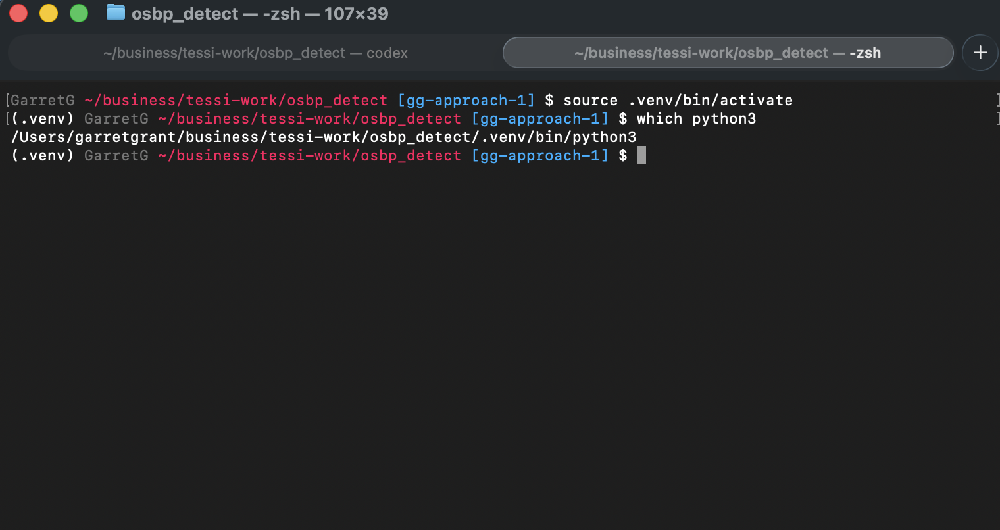

# Instructions for macOS

## Requirements

### Prerequisites - Complete Before Continuing

Before continuing, review and complete the dependency checklist in
[install-requirements.md](install-requirements.md). It covers installing
`Homebrew` and the `just` task runner.

## A. Installation

**Run these steps once per machine (new laptops only need this initial setup).**

1. Open Terminal (`Launchpad → Terminal`).
2. Clone the repository (replace the destination path if needed):
   ```bash
   cd ~/<desired_location_of_tool>
   git clone https://github.com/garretdgrant/osbp_detect.git
   cd osbp_detect
   ```
3. Run the automated setup (installs Python, creates `.venv`, upgrades pip, and
   installs dependencies):
   ```bash
   just install-prereqs
   ```

## B. Run Software

**Activate the virtual environment every time you open a new terminal session.**

1. Activate the virtual environment (required each time you open a new terminal
   session):
   ```bash
   cd ~/<path_to_tool>/osbp_detect
   source .venv/bin/activate
   ```
2. Confirm the activation (prompt should show `(.venv)` and `which python3`
   should point inside the repo):
   ```bash
   which python3
   ```
   Example:
   ```
   (.venv) GarretG ~/osbp_detect $ which python3
   /Users/garretgrant/osbp_detect/.venv/bin/python3
   ```
    Note how `.venv`
   appears in the path after `which python3` command—this confirms Python is
   running inside the virtual environment. If it does not, repeat the activation
   step before running the tools.

### GUI

```bash
just run-gui
```

GUI runs create a timestamped output folder in the selected output directory
named `dd-mm-yy_HH-MM-SS_osbp_result` using PST time. If that folder already
exists (rare, since it requires two runs at the exact same second), an
incrementing suffix is added (e.g., `_2`).

### CLI

```bash
python3 run.py -i /path/to/file.fast5 -r 1-64
```

Use `-s` for explicit channel lists and `-b` to blacklist channels. The CLI now
creates three TSVs by default:

- `<input>.detections.tsv` for all detected events
- `<input>.detections.cleaned.tsv` excluding channels with too many events
- `<input>.detections.skipped.tsv` listing the excluded channels

Override filenames with `--output`, `--output-clean`, and `--output-skipped`.
Control the cleaning threshold via `--max-events-clean` (default: 20000).

## C. Update Software

```bash
cd ~/osbp_detect
git pull
just install-prereqs
```

Re-activate your virtual environment before reinstalling dependencies if you
opened a new terminal session.
